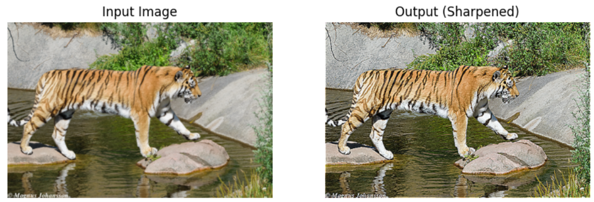
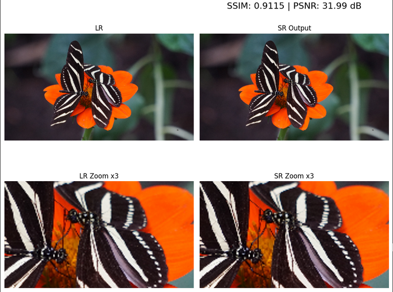

# Team-ClearSight
# Image Sharpening Using Knowledge Distillation for Video Conferencing

 A high-performance image sharpening model for real-time video conferencing using a Teacher-Student Knowledge Distillation framework.

---

# Team Details:
--

- **Mentor**: **Anupama Angadi**, Email: **aangadi@gitam.edu**

- **Leader**: **Gompa Harshit Abhinav**, Roll No: **VU22CSEN0100601**, Email: **hgompa2@gitam.in**

- **Member 2**: **B. Abhinav Reddy**, Roll No: **VU22CSEN030018**, Email: **abonthu@gitam.in**

- **Member 3**: **Challa Sai Lalasa**, Roll No: **VU22CSEN0100812**, Email: **schalla12@gitam.in**

---

---

## Video walkthrough of the project : https://screenrec.com/share/G9bomHyFrZ

## Abstract:

In modern virtual communication, poor video clarity due to limited bandwidth or network noise can degrade user experience. This project addresses this challenge by developing an ultra-lightweight image sharpening model capable of operating in real-time (30–60 FPS) while retaining the performance of a heavier pre-trained teacher model. The solution employs a **Knowledge Distillation (KD)** framework where a **SwinIR** model serves as the teacher, and a compact **IMDN** model is trained to replicate its sharpening capabilities.

## Problem Statement:

 **Objective**: Enhance image sharpness during video conferencing by reducing blurriness caused by compression and network issues.

 **Approach**: Use a teacher-student KD technique to distill knowledge from a computationally expensive model into a real-time lightweight model.

---

##  Model Architecture:

### 🔹 Teacher Model: [SwinIR (Swin Transformer for Image Restoration)](https://github.com/JingyunLiang/SwinIR)

- High-capacity model using Swin Transformer blocks
- Achieves strong performance on image enhancement tasks

### 🔹 Student Model: IMDN (Information Multi-Distillation Network)

- Lightweight CNN-based model with multi-distillation modules
- Optimized for speed and real-time inference

## Results
  Image1                   | Image2                 |
|--------------------------|------------------------|
|           |        |

